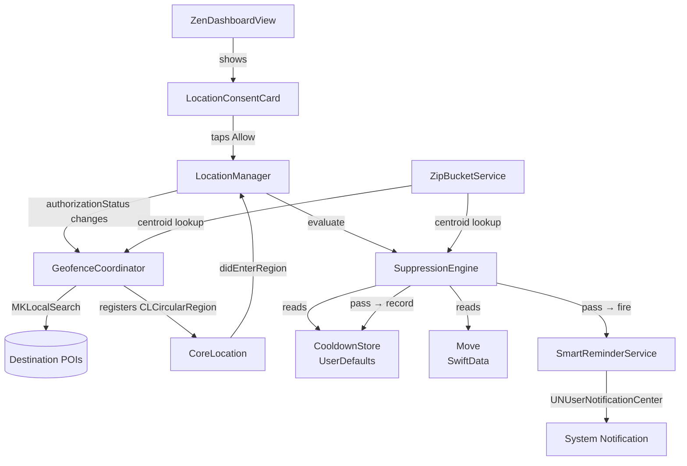

# Design Document — Smart Location Reminders

## Overview

Smart Location Reminders adds a consent-based, proximity-aware notification layer to movingsoon.app. When a user's move is ≤14 days away, a dismissible card on `ZenDashboardView` prompts for location access. Once granted, the system monitors the user's proximity to real destination-area POIs (resolved via `MKLocalSearch`) and fires a single, well-timed push notification when the user is near a place relevant to a pending address-change task.

A six-gate `SuppressionEngine` prevents over-notification: the user must be within 8 km of their destination, have a relevant pending task, not have been notified for that POI type today, be below 80% move completion, be within the 09:00–19:00 window, and still be within the 30-day consent window. Consent is recorded once on the `Move` model and never re-requested.

### Key Design Decisions

- **Offline-first coordinate seeding**: Destination ZIP → `CLLocationCoordinate2D` is resolved from a static centroid lookup table in `ZipBucketService`, avoiding any network call for the distance gate and `MKLocalSearch` search origin. This keeps the feature functional even without connectivity at geofence-setup time.
- **Stateless suppression**: `SuppressionEngine` is a pure, stateless evaluator (no stored state of its own). All state it needs is passed in — `Move`, `POICategory`, `CooldownStore`, current `Date`, current location. This makes it trivially testable.
- **UserDefaults for cooldown**: The cooldown store is intentionally lightweight. A `[String: Date]` dictionary keyed by `POICategory.rawValue` is sufficient; SwiftData would be overkill for six keys.
- **20-geofence cap**: iOS CoreLocation enforces a hard limit of 20 simultaneously monitored regions per app. `GeofenceCoordinator` respects this by capping registration at 20, prioritising tasks by `tMinusDays` (most urgent first).
- **`@Observable` throughout**: New service classes follow the existing project pattern of `@Observable final class`.

---

## Architecture

The feature is composed of five new/upgraded components wired together through the existing `LocationManager` delegate callback.



### Data Flow: Geofence Entry → Notification

1. CoreLocation calls `locationManager(_:didEnterRegion:)` on `LocationManager`.
2. `LocationManager` extracts the `taskID` from the region identifier, looks up the matching `ChecklistTask` and its `POICategory`.
3. `LocationManager` calls `SuppressionEngine.shouldFire(move:poiCategory:cooldownStore:now:userLocation:)`.
4. `SuppressionEngine` evaluates all six gates in order (fail-fast). Returns `true` only if all pass.
5. On `true`, `LocationManager` calls `SmartReminderService.fireLocationNotification(task:poiCategory:)` and `CooldownStore.record(category:date:)`.

---

## Components and Interfaces

### 1. `LocationConsentCard` (new SwiftUI View)

A dismissible card rendered inside `ZenDashboardView` when the consent prompt conditions are met.

```swift
struct LocationConsentCard: View {
    let onAllow: () -> Void
    let onDismiss: () -> Void
}
```

**Display condition** (evaluated in `ZenDashboardView`):
```swift
var shouldShowConsentCard: Bool {
    guard move.locationConsentGrantedAt == nil else { return false }
    guard move.daysUntilMove <= 14 else { return false }
    let status = locationManager.authorizationStatus
    return status == .notDetermined || status == .denied
}
```

The card is session-dismissed via a `@State var consentCardDismissed: Bool` on `ZenDashboardView`. Tapping "Not Now" sets this flag; it resets on next app launch.

### 2. `SuppressionEngine` (new enum — stateless namespace)

A pure, stateless evaluator. Implemented as a caseless `enum` to prevent instantiation.

```swift
enum SuppressionEngine {
    struct Context {
        let move: Move
        let poiCategory: POICategory
        let cooldownStore: CooldownStore
        let now: Date
        let userLocation: CLLocation
        let destinationCoordinate: CLLocationCoordinate2D
    }

    /// Returns true only when all six gates pass.
    static func shouldFire(context: Context) -> Bool

    // Individual gate evaluators (internal, exposed for testing)
    static func distanceGatePasses(userLocation: CLLocation,
                                   destination: CLLocationCoordinate2D) -> Bool
    static func taskRelevanceGatePasses(tasks: [ChecklistTask],
                                        category: POICategory) -> Bool
    static func cooldownGatePasses(store: CooldownStore,
                                   category: POICategory,
                                   now: Date) -> Bool
    static func completionGatePasses(fraction: Double) -> Bool
    static func timeOfDayGatePasses(now: Date) -> Bool
    static func consentExpiryGatePasses(grantedAt: Date?, now: Date) -> Bool
}
```

Gate evaluation order (fail-fast for performance):
1. Consent expiry gate
2. Completion gate
3. Time-of-day gate
4. Distance gate
5. Task relevance gate
6. Cooldown gate

### 3. `CooldownStore` (new struct)

A thin `UserDefaults` wrapper. Keyed by `POICategory.rawValue`.

```swift
struct CooldownStore {
    private let defaults: UserDefaults
    private let key = "com.movingsoon.cooldownStore"

    init(defaults: UserDefaults = .standard)

    /// Returns true if the gate passes (no entry today).
    func gatePasses(for category: POICategory, now: Date) -> Bool

    /// Records the current date for a category after a notification fires.
    mutating func record(category: POICategory, date: Date)

    /// Clears all cooldown entries (used in tests and on consent revocation).
    mutating func clearAll()
}
```

Storage format: `UserDefaults` key `"com.movingsoon.cooldownStore"` → `Data` (JSON-encoded `[String: Date]`).

### 4. `GeofenceCoordinator` (new `@Observable` class)

Owns `MKLocalSearch` queries and geofence lifecycle. Replaces the mock coordinate logic in `LocationManager`.

```swift
@Observable
final class GeofenceCoordinator {
    private(set) var registeredRegionIDs: Set<String> = []

    /// Resolves POI coordinates via MKLocalSearch and registers geofences.
    /// Caps at 20 regions; prioritises tasks by tMinusDays ascending.
    func syncGeofences(for tasks: [ChecklistTask],
                       destinationCoordinate: CLLocationCoordinate2D,
                       manager: CLLocationManager) async

    /// Removes the geofence for a specific task.
    func removeGeofence(for task: ChecklistTask, manager: CLLocationManager)

    /// Removes all geofences (called on consent expiry).
    func removeAllGeofences(manager: CLLocationManager)
}
```

`MKLocalSearch` query construction per `POICategory`:

| POICategory | MKLocalSearch natural language query |
|---|---|
| `.bank` | `"bank"` |
| `.gym` | `"gym"` |
| `.dmv` | `"DMV department of motor vehicles"` |
| `.grocery` | `"grocery store supermarket"` |
| `.postOffice` | `"post office USPS"` |
| `.pharmacy` | `"pharmacy drugstore"` |
| `.other` | `"address update"` |

### 5. Upgrades to `LocationManager`

- Remove the hardcoded Denver mock coordinate.
- Inject `GeofenceCoordinator` and `SuppressionEngine` context.
- In `didEnterRegion`: look up the task by region identifier, build a `SuppressionEngine.Context`, call `SuppressionEngine.shouldFire`, and on pass call `SmartReminderService.fireLocationNotification` + `CooldownStore.record`.
- Expose `currentLocation: CLLocation?` (updated via `didUpdateLocations`) for the distance gate.

```swift
@Observable
final class LocationManager: NSObject, CLLocationManagerDelegate {
    var authorizationStatus: CLAuthorizationStatus = .notDetermined
    var currentLocation: CLLocation?
    var geofenceCoordinator = GeofenceCoordinator()

    // Injected at call site
    var move: Move?
    var cooldownStore = CooldownStore()
}
```

### 6. Upgrades to `Move`

Add one optional field:

```swift
var locationConsentGrantedAt: Date?
```

No migration required — SwiftData handles optional additions automatically.

### 7. Upgrades to `ZipBucketService`

Add a static centroid lookup table returning the geographic centre of each supported metro area. Used as the search origin for `MKLocalSearch` and as the reference point for the distance gate.

```swift
extension ZipBucketService {
    /// Returns the approximate geographic centroid for a destination ZIP.
    /// Falls back to the continental US centroid (39.5, -98.35) for unknown ZIPs.
    static func centroid(zip: String) -> CLLocationCoordinate2D
}
```

The lookup table covers the same ~40 metro areas already present in `cityBucket(zip:)`, mapping city bucket strings to `(lat, lon)` pairs. Rural ZIPs fall back to the continental US centroid.

### 8. Upgrades to `SmartReminderService`

Add one new method:

```swift
func fireLocationNotification(task: ChecklistTask, poiCategory: POICategory)
```

This method:
- Sets `content.title = "Address update nearby"`
- Sets `content.body = "You're near a \(poiCategory.displayName) — update your address while you're here."`
- Sets `content.userInfo = ["taskID": task.id.uuidString]`
- Sets `content.sound = .default`
- Fires immediately (nil trigger)

`POICategory` needs a `displayName: String` computed property returning the lowercase display name (e.g. `"post office"` for `.postOffice`).

---

## Data Models

### `Move` additions

```swift
@Model
final class Move {
    // ... existing fields ...
    var locationConsentGrantedAt: Date?   // NEW — nil until user grants consent
}
```

### `CooldownStore` storage schema

```
UserDefaults key: "com.movingsoon.cooldownStore"
Value type: Data (JSON-encoded [String: Date])
Keys: POICategory.rawValue strings ("Bank", "Gym", "DMV", etc.)
Values: ISO-8601 Date of last notification fire for that category
```

### `CLCircularRegion` identifier convention

Region identifiers are the `ChecklistTask.id.uuidString`. This allows `LocationManager.didEnterRegion` to look up the task directly from the `Move.tasks` array without a separate mapping table.

### `POICategory.displayName`

```swift
extension POICategory {
    var displayName: String {
        switch self {
        case .bank:       return "bank"
        case .gym:        return "gym"
        case .dmv:        return "DMV"
        case .grocery:    return "grocery store"
        case .postOffice: return "post office"
        case .pharmacy:   return "pharmacy"
        case .other:      return "location"
        }
    }
}
```

---

## Correctness Properties

*A property is a characteristic or behavior that should hold true across all valid executions of a system — essentially, a formal statement about what the system should do. Properties serve as the bridge between human-readable specifications and machine-verifiable correctness guarantees.*

### Property 1: Consent card visibility is determined by consent history and proximity to move date

*For any* `Move` with a non-nil `locationConsentGrantedAt`, the `shouldShowConsentCard` predicate SHALL return `false`, regardless of `daysUntilMove`, `authorizationStatus`, or session dismissal state. Conversely, *for any* `Move` with a nil `locationConsentGrantedAt` and `daysUntilMove ≤ 14`, the predicate SHALL return `true` when `authorizationStatus` is `.notDetermined` or `.denied`.

**Validates: Requirements 1.1, 1.2**

### Property 2: Consent expiry gate is a pure function of two dates

*For any* pair `(grantedAt: Date, now: Date)`, `SuppressionEngine.consentExpiryGatePasses(grantedAt:now:)` SHALL return `true` if and only if `now ≤ grantedAt + 30 days`. The result depends solely on the two date inputs and no other state.

**Validates: Requirements 2.2, 4.7**

### Property 3: Geofence count never exceeds 20 and matches pending POI tasks

*For any* list of `ChecklistTask` values, after `GeofenceCoordinator.syncGeofences` completes, the number of registered `CLCircularRegion`s SHALL be `min(pendingPOITaskCount, 20)`, where `pendingPOITaskCount` is the count of tasks with `status == .toDo` and non-nil `poiCategory`.

**Validates: Requirements 2.5, 3.5**

### Property 4: All registered geofences have radius exactly 200 metres

*For any* set of resolved POI coordinates, every `CLCircularRegion` registered by `GeofenceCoordinator` SHALL have `radius == 200.0`.

**Validates: Requirements 3.2**

### Property 5: Completing or verifying a task removes its geofence

*For any* `ChecklistTask` that has a registered geofence, advancing its status to `.completed` or `.pendingVerification` SHALL cause `GeofenceCoordinator` to call `stopMonitoring` for the region whose identifier equals `task.id.uuidString`.

**Validates: Requirements 3.3**

### Property 6: Distance gate is a pure function of two coordinates

*For any* pair `(userLocation: CLLocation, destination: CLLocationCoordinate2D)`, `SuppressionEngine.distanceGatePasses` SHALL return `true` if and only if the haversine distance between the two points is ≤ 8,000 metres.

**Validates: Requirements 4.2**

### Property 7: Task relevance gate reflects pending task existence

*For any* list of `ChecklistTask` values and any `POICategory`, `SuppressionEngine.taskRelevanceGatePasses` SHALL return `true` if and only if at least one task in the list has `status == .toDo` and `poiCategory == category`.

**Validates: Requirements 4.3**

### Property 8: Cooldown gate is a pure function of stored date and current date

*For any* `(POICategory, lastFiredDate: Date?, now: Date)` triple, `SuppressionEngine.cooldownGatePasses` SHALL return `true` if and only if `lastFiredDate` is `nil` or `lastFiredDate` falls on a different calendar day than `now` (using the device's current calendar).

**Validates: Requirements 4.4, 5.3, 5.4**

### Property 9: Completion gate threshold is exactly 0.80

*For any* `completionFraction: Double` in `[0.0, 1.0]`, `SuppressionEngine.completionGatePasses` SHALL return `true` if and only if `completionFraction < 0.80`.

**Validates: Requirements 4.5**

### Property 10: Time-of-day gate passes only within the 09:00–19:00 window

*For any* `Date`, `SuppressionEngine.timeOfDayGatePasses` SHALL return `true` if and only if the hour component (in the device's local calendar) satisfies `9 ≤ hour < 19`.

**Validates: Requirements 4.6**

### Property 11: CooldownStore round-trip preserves recorded dates

*For any* `POICategory` and `Date`, recording the date via `CooldownStore.record(category:date:)` and then reading it back SHALL return a date on the same calendar day as the recorded date. The store SHALL persist this value across re-initialisation from the same `UserDefaults` instance.

**Validates: Requirements 5.1, 5.2**

### Property 12: Notification body contains the POI category display name

*For any* `POICategory`, the notification body produced by `SmartReminderService.fireLocationNotification` SHALL contain `poiCategory.displayName` as a substring.

**Validates: Requirements 6.2**

### Property 13: Notification userInfo contains the task ID

*For any* `ChecklistTask`, the notification produced by `SmartReminderService.fireLocationNotification(task:poiCategory:)` SHALL have `userInfo["taskID"]` equal to `task.id.uuidString`.

**Validates: Requirements 6.3**

---

## Error Handling

| Scenario | Handling |
|---|---|
| `MKLocalSearch` returns no results for a `POICategory` | Skip geofence registration for that task; emit `os_log` diagnostic at `.debug` level. No user-visible error. |
| `CLLocationManager.startMonitoring` fails (e.g. region limit exceeded) | `GeofenceCoordinator` catches the delegate error callback and logs it. The 20-region cap prevents this in normal operation. |
| `UserDefaults` write fails | `CooldownStore` silently skips the write. The worst outcome is a duplicate notification on the same day — acceptable given the rarity of `UserDefaults` failures. |
| `locationConsentGrantedAt` is nil when `SuppressionEngine` evaluates the expiry gate | Treated as expired (gate fails). This is a safe default — no consent recorded means no monitoring should occur. |
| `Move.destinationZip` not in centroid lookup table | `ZipBucketService.centroid(zip:)` returns the continental US centroid `(39.5, -98.35)`. The distance gate will likely suppress notifications (user is unlikely to be within 8 km of the geographic centre of the US), which is the safe fallback. |
| Device location unavailable when `didEnterRegion` fires | `LocationManager.currentLocation` is `nil`; `SuppressionEngine` treats a nil location as a distance gate failure and suppresses the notification. |

---

## Testing Strategy

### Property-Based Testing

The project should adopt [SwiftCheck](https://github.com/typelift/SwiftCheck) (Swift port of QuickCheck) for property-based tests. Each property test runs a minimum of 100 iterations.

Tag format for each test: `// Feature: smart-location-reminders, Property N: <property text>`

Properties 2, 6, 7, 8, 9, 10 are pure functions with no dependencies — ideal candidates for property-based testing with generated inputs.

Properties 1, 3, 4, 5, 11, 12, 13 require lightweight model construction but remain fast in-memory tests.

### Unit Tests (Example-Based)

- `LocationConsentCard` renders correct copy text (Req 1.3)
- `LocationConsentCard` renders both action buttons (Req 1.4)
- Tapping "Allow 30 Days" calls `requestAlwaysAuthorization()` on a mock `CLLocationManager` (Req 1.5)
- Tapping "Not Now" sets `consentCardDismissed = true` (Req 1.6)
- Authorization grant sets `move.locationConsentGrantedAt` to approximately `Date()` (Req 1.7)
- `Move.locationConsentGrantedAt` persists across SwiftData save/reload (Req 2.1)
- Consent expiry calls `stopMonitoring` for all registered regions (Req 2.3)
- `MKLocalSearch` returning empty results skips registration and logs (Req 3.4)
- All six gates passing fires notification and updates `CooldownStore` (Req 4.1, 4.8)
- Notification title is exactly `"Address update nearby"` (Req 6.1)
- Notification sound is `.default` (Req 6.4)

### Integration Tests

- `GeofenceCoordinator.syncGeofences` calls `MKLocalSearch` once per pending POI task (Req 3.1) — verified with a mock `MKLocalSearch` provider injected via protocol.

### Test File Layout

```
movingsoon.appTests/
  SmartLocationReminders/
    SuppressionEngineTests.swift      // Properties 2, 6, 7, 8, 9, 10 + unit tests
    CooldownStoreTests.swift          // Property 11
    GeofenceCoordinatorTests.swift    // Properties 3, 4, 5 + integration test
    SmartReminderServiceTests.swift   // Properties 12, 13 + unit tests
    LocationConsentCardTests.swift    // Unit tests for card display logic
```
